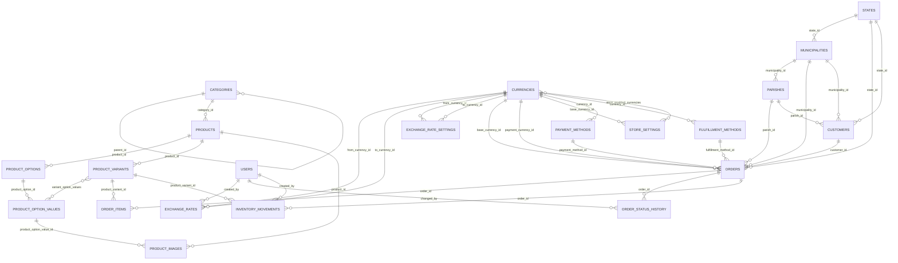

# Esquema de base de datos

Documentación del esquema de PostgreSQL para el backend Laravel 13, generada
a partir de las migraciones de la Fase 1 (`2026_07_01_1630XX_*`). Cubre
catálogo con variantes, multimoneda, ubicación geográfica de Venezuela,
órdenes, configuración de tienda y usuarios/clientes.

Los nombres de tablas y columnas se mantienen en inglés, tal como están en
el código.

## 1. Diagrama entidad-relación

## 2. Catálogo

### categories

Categorías de producto, con soporte para jerarquía de un nivel de anidación
(auto-referencia `parent_id`).

| Columna | Tipo | Nullable | Default | FK a |
|---|---|---|---|---|
| id | bigint | no | — | — |
| name | string | no | — | — |
| slug | string | no | — | — |
| parent_id | bigint | sí | null | categories.id (nullOnDelete) |
| description | text | sí | null | — |
| created_at / updated_at | timestamp | sí | — | — |

**Índices/constraints:** `slug` único.

### products

Entidad base del catálogo. El precio y stock reales viven en `product_variants`.

| Columna | Tipo | Nullable | Default | FK a |
|---|---|---|---|---|
| id | bigint | no | — | — |
| category_id | bigint | sí | null | categories.id (nullOnDelete) |
| name | string | no | — | — |
| slug | string | no | — | — |
| description | text | sí | null | — |
| base_price | decimal(18,6) | no | — | — |
| is_active | boolean | no | true | — |
| created_at / updated_at | timestamp | sí | — | — |
| deleted_at | timestamp | sí | null | — |

**Índices/constraints:** `slug` único. Soft deletes.

**Reglas de negocio:**
- Todo producto tiene al menos una variante, incluso sin opciones
  configuradas (variante implícita = el producto mismo). Evita ramificar la
  lógica de carrito/inventario entre "productos simples" y "con variantes".
- El precio de una variante puede sobrescribir `base_price` vía
  `price_override`; si es nulo, se usa el precio base del producto
  (`ProductVariant::effectivePrice()`).
- El `slug` lo deriva el backend del nombre (`Product::uniqueSlug()`), y
  renombrar un producto **no** lo cambia: es la URL pública que un cliente pudo
  guardar. Cambiarlo es un acto aparte y explícito.
- "Eliminar" desde el panel es baja lógica (`Product::archive()`) y arrastra a
  las variantes vivas; restaurar devuelve el producto con todas sus variantes.
  El borrado real está descartado porque `order_items` apunta a esas variantes.
  Ver `docs/decisions.md`.
- `is_active` (despublicar) y `deleted_at` (archivar) son cosas distintas: la
  primera esconde el producto del storefront, la segunda lo saca del catálogo.

### product_options

Atributos configurables por producto (ej. "Color", "Talla"). Un producto
puede tener 0, 1 o varias opciones.

| Columna | Tipo | Nullable | Default | FK a |
|---|---|---|---|---|
| id | bigint | no | — | — |
| product_id | bigint | no | — | products.id (cascadeOnDelete) |
| name | string | no | — | — |
| position | unsignedInteger | no | 0 | — |
| created_at / updated_at | timestamp | sí | — | — |

**Índices/constraints:** índice compuesto `(product_id, position)`.

### product_option_values

Valores posibles de cada opción (ej. Color → Rojo, Azul, Negro).

| Columna | Tipo | Nullable | Default | FK a |
|---|---|---|---|---|
| id | bigint | no | — | — |
| product_option_id | bigint | no | — | product_options.id (cascadeOnDelete) |
| value | string | no | — | — |
| position | unsignedInteger | no | 0 | — |
| created_at / updated_at | timestamp | sí | — | — |

### product_variants

Unidad real de venta: combinación específica de valores de opción, con SKU,
stock y precio propios.

| Columna | Tipo | Nullable | Default | FK a |
|---|---|---|---|---|
| id | bigint | no | — | — |
| product_id | bigint | no | — | products.id (cascadeOnDelete) |
| sku | string | no | — | — |
| price_override | decimal(18,6) | sí | null | — |
| stock | integer | no | 0 | — |
| reserved_quantity | unsignedInteger | no | 0 | — |
| reserved_until | timestamp | sí | null | — |
| is_active | boolean | no | true | — |
| created_at / updated_at | timestamp | sí | — | — |
| deleted_at | timestamp | sí | null | — |

**Índices/constraints:** `sku` único. Soft deletes.

**Reglas de negocio:**
- El stock se controla a nivel de variante, nunca a nivel de producto.
- `reserved_quantity`/`reserved_until` representan la reserva transitoria del
  ciclo `pending_payment → paid` (PRD sección 5quater): al crear la orden se
  reserva stock (no se descuenta todavía); al confirmarse el pago la reserva
  se convierte en descuento definitivo; si la orden se cancela/rechaza o la
  reserva expira, el stock se libera. La reserva **sí** deja fila en
  `inventory_movements` (corrección del 2026-07-02, ver `docs/decisions.md`);
  lo que no se audita ahí es el saldo vivo, que vive en `reserved_quantity`.
- Por defecto no se permite backorder/preventa: si el stock disponible de una
  variante es 0, no puede completarse una orden con ella.
- La operación de reservar stock es atómica (lectura + reserva en la misma
  transacción con `lockForUpdate()`), para evitar sobreventa por concurrencia
  — implementada en `InventoryReservationService` (Fase 3).
- `stock` nunca se escribe como un campo de formulario: cambiarlo exige motivo
  y pasa por `InventoryReservationService::adjust()`, que deja la fila
  `adjustment` en el kardex. La edición de variante desde el panel rechaza
  `stock` y `reserved_quantity`. Ver `docs/decisions.md`.
- Un ajuste manual nunca puede dejar `stock` por debajo de
  `reserved_quantity`: esas unidades ya están prometidas a órdenes abiertas.
- Todo producto tiene al menos una variante viva: la última no se puede
  archivar (para retirar el producto entero se archiva el producto).

### variant_option_values

Tabla pivot que asocia cada variante con los valores de opción que la
componen (ej. Rojo + Talla 40). No tiene modelo Eloquent propio: se maneja
como relación `belongsToMany` entre `ProductVariant` y `ProductOptionValue`.

| Columna | Tipo | Nullable | Default | FK a |
|---|---|---|---|---|
| id | bigint | no | — | — |
| product_variant_id | bigint | no | — | product_variants.id (cascadeOnDelete) |
| product_option_value_id | bigint | no | — | product_option_values.id (cascadeOnDelete) |
| created_at | timestamp | sí | null | — |

**Índices/constraints:** único compuesto `(product_variant_id, product_option_value_id)`; índice en `product_option_value_id`. Sin `updated_at` (solo `created_at`).

### product_images

Imágenes de producto, asociadas preferentemente al valor de opción visual
(normalmente color) para que todas las variantes que comparten ese valor
hereden las mismas fotos sin duplicación.

| Columna | Tipo | Nullable | Default | FK a |
|---|---|---|---|---|
| id | bigint | no | — | — |
| product_id | bigint | no | — | products.id (cascadeOnDelete) |
| product_option_value_id | bigint | sí | null | product_option_values.id (nullOnDelete) |
| path | string | no | — | — |
| position | unsignedInteger | no | 0 | — |
| is_primary | boolean | no | false | — |
| created_at / updated_at | timestamp | sí | — | — |

**Índices/constraints:** índice compuesto `(product_id, product_option_value_id)`.

**Reglas de negocio:**
- Si el producto no tiene una opción visual, las imágenes quedan asociadas
  directamente al producto (`product_option_value_id` nulo).
- Un producto tiene exactamente una imagen principal: la primera que se sube lo
  es, marcar otra se la quita a la anterior, y borrar la principal se la pasa a
  la siguiente. El storefront ordena por `is_primary` y luego por `position`.
- `path` es relativo al disco de `commerce.product_image.disk` (por defecto
  `public`, servido por el servidor web vía `storage:link` — no por la API,
  a diferencia de los comprobantes de pago). El nombre guardado es siempre un
  UUID: el original lo elige quien sube el archivo.
- `position` es contiguo y por producto: el reordenamiento reescribe la lista
  entera, nunca un subconjunto.

## 3. Multimoneda

### currencies

Catálogo de monedas soportadas (Bs, USD, USDT, COP, etc.).

| Columna | Tipo | Nullable | Default | FK a |
|---|---|---|---|---|
| id | bigint | no | — | — |
| code | string(4) | no | — | — |
| name | string | no | — | — |
| symbol | string(8) | no | — | — |
| decimal_places | unsignedTinyInteger | no | 2 | — |
| is_active | boolean | no | true | — |
| created_at / updated_at | timestamp | sí | — | — |

**Índices/constraints:** `code` único.

### exchange_rates

Historial de tasas de cambio aplicadas.

| Columna | Tipo | Nullable | Default | FK a |
|---|---|---|---|---|
| id | bigint | no | — | — |
| from_currency_id | bigint | no | — | currencies.id |
| to_currency_id | bigint | no | — | currencies.id |
| rate | decimal(18,6) | no | — | — |
| source | string(50) | no | — | — |
| reference_amount | decimal(18,6) | sí | null | — |
| effective_at | timestamp | no | — | — |
| created_by | bigint | sí | null | users.id (nullOnDelete) |
| created_at / updated_at | timestamp | sí | — | — |

**Índices/constraints:** índice compuesto `(from_currency_id, to_currency_id, effective_at)`.

**Reglas de negocio:**
- Tabla append-only: nunca se actualiza una fila existente, siempre se
  inserta una nueva tasa con su propio `effective_at`. El historial completo
  queda disponible para auditoría.
- El panel lo respeta a nivel de API: sobre `exchange_rates` solo existen `GET`
  y `POST`. Corregir una tasa equivocada es registrar la buena ahora, porque
  `orders.exchange_rate_applied` se justifica contra este historial y reescribir
  una fila haría que una orden correcta pareciera equivocada. Ver
  `docs/decisions.md`.
- `created_by` distingue quién produjo el número: con valor para la tasa que un
  admin escribió a mano (`ExchangeRateService::storeManual()`, `source` =
  `manual`), y en `null` para la que reportó una fuente automática
  (`ExchangeRateService::refresh()`), donde no lo decidió nadie.

### exchange_rate_settings

Configuración de cómo se obtiene la tasa para cada par de monedas (manual vs
automática, proveedor, frecuencia de actualización).

| Columna | Tipo | Nullable | Default | FK a |
|---|---|---|---|---|
| id | bigint | no | — | — |
| from_currency_id | bigint | no | — | currencies.id |
| to_currency_id | bigint | no | — | currencies.id |
| mode | string | no | — | — (enum `ExchangeRateMode`: `manual`, `automatic`) |
| provider | string(50) | sí | null | — |
| frequency_minutes | unsignedInteger | sí | null | — |
| reference_amount | decimal(18,6) | sí | null | — |
| is_active | boolean | no | true | — |
| last_run_at | timestamp | sí | null | — |
| last_error_at | timestamp | sí | null | — |
| last_error | text | sí | null | — |
| created_at / updated_at | timestamp | sí | — | — |

**Índices/constraints:** único compuesto `(from_currency_id, to_currency_id)` — una única configuración activa por par de monedas.

**Reglas de negocio:**
- Las tres columnas de seguimiento existen porque un refresco fallido no
  escribe nada en `exchange_rates`: sin ellas, una fuente rota es invisible
  hasta que la tasa está muy vieja (PRD 8bis). `last_run_at` avanza en los dos
  desenlaces, para que una fuente que falla no se reintente en cada tick.
- El par (`from_currency_id`, `to_currency_id`) no se edita: el historial de
  refresco describe el par para el que corrió. Se elimina la configuración y se
  crea la otra.
- Un par en modo `automatic` exige un `provider` automático. Apuntarlo a
  `manual` sería un horario sin nada que llamar: `refresh()` lo saltaría en
  silencio y el par se vería configurado sin actualizarse nunca.
- Eliminar una configuración detiene la automatización pero no toca las tasas
  ya registradas para ese par.

## 4. Ubicación geográfica

### states

Estados de Venezuela.

| Columna | Tipo | Nullable | Default | FK a |
|---|---|---|---|---|
| id | bigint | no | — | — |
| name | string | no | — | — |
| code | string(4) | sí | null | — |
| created_at / updated_at | timestamp | sí | — | — |

### municipalities

| Columna | Tipo | Nullable | Default | FK a |
|---|---|---|---|---|
| id | bigint | no | — | — |
| state_id | bigint | no | — | states.id (cascadeOnDelete) |
| name | string | no | — | — |
| created_at / updated_at | timestamp | sí | — | — |

**Índices/constraints:** índice compuesto `(state_id, name)`.

### parishes

| Columna | Tipo | Nullable | Default | FK a |
|---|---|---|---|---|
| id | bigint | no | — | — |
| municipality_id | bigint | no | — | municipalities.id (cascadeOnDelete) |
| name | string | no | — | — |
| created_at / updated_at | timestamp | sí | — | — |

**Índices/constraints:** índice compuesto `(municipality_id, name)`.

## 5. Órdenes e inventario

### orders

Cabecera de la orden. Los datos de dirección, documento y moneda son
snapshot al momento de crear la orden.

| Columna | Tipo | Nullable | Default | FK a |
|---|---|---|---|---|
| id | bigint | no | — | — |
| customer_id | bigint | sí | null | customers.id (nullOnDelete) |
| status | string | no | — | — (enum `OrderStatus`, ver abajo) |
| order_number | string | no | — | — |
| customer_name | string | no | — | — |
| customer_phone | string(20) | no | — | — |
| document_type | string(4) | no | — | — (enum `DocumentType`) |
| document_number | string(20) | no | — | — |
| state_id | bigint | sí | null | states.id (restrictOnDelete) |
| municipality_id | bigint | sí | null | municipalities.id (restrictOnDelete) |
| parish_id | bigint | sí | null | parishes.id (restrictOnDelete) |
| address_reference | text | sí | null | — |
| base_currency_id | bigint | no | — | currencies.id |
| base_amount | decimal(18,6) | no | — | — |
| payment_currency_id | bigint | no | — | currencies.id |
| exchange_rate_applied | decimal(18,6) | no | — | — |
| payment_amount | decimal(18,6) | no | — | — |
| payment_method_id | bigint | sí | null | payment_methods.id (nullOnDelete) |
| fulfillment_method_id | bigint | sí | null | fulfillment_methods.id (nullOnDelete) |
| created_at / updated_at | timestamp | sí | — | — |

**Índices/constraints:** `order_number` único; índice en `status`; índice en `customer_id`.

**Reglas de negocio:**
- Los campos `customer_name`, `customer_phone`, `document_type`,
  `document_number` y de dirección (`state_id`/`municipality_id`/`parish_id`/
  `address_reference`) son un snapshot inmutable al momento de la orden, no
  una referencia viva al `Customer` — por eso `customer_id` es nullable y
  además existen estos campos duplicados en la orden. Un cambio posterior en
  los datos del cliente no debe alterar órdenes ya creadas.
- Las FK de ubicación usan `restrictOnDelete` (a diferencia de `customers`,
  que usa `nullOnDelete`): no se puede borrar un estado/municipio/parroquia
  si hay órdenes que lo referencian.
- El método de pago define la moneda de pago (`payment_currency_id`); el
  monto base (`base_amount`, en la moneda base de la tienda) y el monto de
  pago (`payment_amount`, ya convertido) junto con la tasa aplicada
  (`exchange_rate_applied`) quedan congelados en la orden.

### order_items

Líneas de la orden, con snapshot del producto/variante al momento de compra.

| Columna | Tipo | Nullable | Default | FK a |
|---|---|---|---|---|
| id | bigint | no | — | — |
| order_id | bigint | no | — | orders.id (cascadeOnDelete) |
| product_variant_id | bigint | sí | null | product_variants.id (nullOnDelete) |
| product_name | string | no | — | — |
| variant_description | string | sí | null | — |
| sku | string | no | — | — |
| unit_price | decimal(18,6) | no | — | — |
| quantity | unsignedInteger | no | — | — |
| subtotal | decimal(18,6) | no | — | — |
| created_at / updated_at | timestamp | sí | — | — |

**Índices/constraints:** índice en `order_id`; índice en `product_variant_id`.

**Reglas de negocio:**
- `product_name`, `variant_description`, `sku` y `unit_price` son snapshot
  del producto/variante al momento de la compra (misma lógica que `orders`):
  si el producto cambia de nombre o precio después, el ítem histórico no se
  ve afectado.

### order_status_history

Bitácora de cambios de estado de la orden.

| Columna | Tipo | Nullable | Default | FK a |
|---|---|---|---|---|
| id | bigint | no | — | — |
| order_id | bigint | no | — | orders.id (cascadeOnDelete) |
| from_status | string | sí | null | — |
| to_status | string | no | — | — |
| changed_by | bigint | sí | null | users.id (nullOnDelete) |
| reason | text | sí | null | — |
| created_at | timestamp | no | now() | — |

**Índices/constraints:** índice en `order_id`. Sin `updated_at`.

### inventory_movements

Kardex de inventario: registra los movimientos definitivos de stock, con su
motivo.

| Columna | Tipo | Nullable | Default | FK a |
|---|---|---|---|---|
| id | bigint | no | — | — |
| product_variant_id | bigint | sí | null | product_variants.id (nullOnDelete) |
| sku | string | no | — | — |
| type | string | no | — | — (enum `InventoryMovementType`: `reservation`, `sale`, `release`, `restock`, `adjustment`) |
| quantity_change | integer | no | — | — |
| reason | text | sí | null | — |
| order_id | bigint | sí | null | orders.id (nullOnDelete) |
| created_by | bigint | sí | null | users.id (nullOnDelete) |
| created_at | timestamp | no | now() | — |

**Índices/constraints:** índice compuesto `(product_variant_id, created_at)`. Sin `updated_at`.

**Reglas de negocio:**
- Ledger append-only e inmutable de los movimientos de inventario: reserva al
  crearse la orden (`reservation`), venta confirmada (`sale`), liberación de la
  reserva por cancelación o expiración (`release`), reingreso a stock al
  cancelar una orden que ya estaba pagada (`restock`) y ajuste manual del admin
  (`adjustment`, ej. reposición, corrección de conteo físico, baja por
  daño/pérdida).
- `adjustment` es el único tipo que no produce ningún camino automático: lo
  emite `InventoryReservationService::adjust()` desde
  `POST /api/admin/variants/{variant}/adjust-stock`, con motivo obligatorio y
  el `created_by` del admin. Por eso `reason` es opcional en la columna pero
  obligatorio ahí.
- Es un ledger de solo escritura: nada en el panel edita ni borra una fila. El
  historial por variante se lee paginado desde
  `GET /api/admin/variants/{variant}/movements`.
- La reserva deja su propia fila, pero el saldo vivo de unidades reservadas no
  se lee del kardex: vive en `product_variants.reserved_quantity`. La columna
  `reserved_until` es estado transitorio y no se audita aquí.
- `sku` se duplica en la fila (además de la FK `product_variant_id`, que es
  nullable) para preservar el dato aunque la variante se elimine.

## 6. Configuración de tienda

### store_settings

Configuración global de la tienda. Tabla de fila única (una sola tienda por
instalación del backend).

| Columna | Tipo | Nullable | Default | FK a |
|---|---|---|---|---|
| id | bigint | no | — | — |
| store_name | string | no | — | — |
| logo_path | string | sí | null | — |
| primary_color | string(7) | sí | null | — |
| secondary_color | string(7) | sí | null | — |
| base_currency_id | bigint | no | — | currencies.id |
| whatsapp_number | string(20) | sí | null | — |
| created_at / updated_at | timestamp | sí | — | — |

**Reglas de negocio:**
- Fila única: los endpoints de configuración (`GET`/`PUT /api/admin/settings`)
  no llevan id en la ruta, la resuelven con `StoreSetting::current()`.
- `base_currency_id` tiene que estar siempre entre las monedas habilitadas:
  todos los precios se expresan en ella, así que una base que la tienda no
  acepta dejaría al storefront cotizando en algo que se niega a cobrar.
- No se puede deshabilitar una moneda que cobra un método de pago activo, ni
  crear un método que cobre en una moneda deshabilitada — la misma regla,
  validada por los dos lados.
- `logo_path` es relativo al disco de `commerce.store_logo.disk` (por defecto
  `public`, servido por el servidor web vía `storage:link`). Reemplazar el logo
  borra el archivo anterior.
- Los campos públicos de esta fila (nombre, logo, colores, WhatsApp, moneda
  base) se exponen sin sesión en `GET /api/store`, para que el storefront no
  lleve la identidad de la tienda compilada dentro. Ver `docs/decisions.md`.

### store_enabled_currencies

Pivot: monedas habilitadas para la tienda además de la moneda base.

| Columna | Tipo | Nullable | Default | FK a |
|---|---|---|---|---|
| id | bigint | no | — | — |
| store_setting_id | bigint | no | — | store_settings.id (cascadeOnDelete) |
| currency_id | bigint | no | — | currencies.id (cascadeOnDelete) |
| created_at / updated_at | timestamp | sí | — | — |

**Índices/constraints:** único compuesto `(store_setting_id, currency_id)`.

### payment_methods

Métodos de pago configurables (Pago Móvil, Zelle, Binance Pay, etc.), cada
uno atado a una única moneda.

| Columna | Tipo | Nullable | Default | FK a |
|---|---|---|---|---|
| id | bigint | no | — | — |
| type | string | no | — | — |
| label | string | no | — | — |
| currency_id | bigint | no | — | currencies.id |
| instructions | json | sí | null | — |
| is_active | boolean | no | true | — |
| position | unsignedInteger | no | 0 | — |
| created_at / updated_at | timestamp | sí | — | — |

**Reglas de negocio:**
- El método de pago define la moneda de la orden (ej. Pago Móvil → Bs,
  Zelle → USD, Binance Pay → USDT); no se le pide al cliente elegir moneda y
  método por separado.
- `type` no es editable: decide el provider, qué campos de cuenta tiene el
  método y si pide comprobante. Cambiarlo reinterpretaría el `instructions`
  guardado como los campos de otro método. Se crea el otro y se desactiva este.
- Las claves válidas de `instructions` son las de
  `PaymentMethodType::instructionFields()` más `notes`, y el alta/edición las
  valida: una clave que el tipo no lee se guardaría y no se le mostraría nunca
  a nadie. Editar reemplaza el blob entero, no lo mezcla.
- Un método con órdenes no se elimina, se desactiva:
  `orders.payment_method_id` es `nullOnDelete`, así que el borrado pasaría y
  borraría en silencio cómo se pagaron esas órdenes.
- `position` decide el orden en el checkout; el panel lo reescribe entero, como
  el reordenamiento de imágenes de producto.

### fulfillment_methods

Métodos de entrega/envío configurables.

| Columna | Tipo | Nullable | Default | FK a |
|---|---|---|---|---|
| id | bigint | no | — | — |
| type | string | no | — | — |
| label | string | no | — | — |
| requires_tracking_code | boolean | no | false | — |
| base_cost | decimal(18,6) | sí | null | — |
| currency_id | bigint | sí | null | currencies.id (nullOnDelete) |
| is_active | boolean | no | true | — |
| position | unsignedInteger | no | 0 | — |
| created_at / updated_at | timestamp | sí | — | — |

## 7. Usuarios y clientes

### users

Usuarios del panel admin (dueño/staff).

| Columna | Tipo | Nullable | Default | FK a |
|---|---|---|---|---|
| id | bigint | no | — | — |
| name | string | no | — | — |
| email | string | no | — | — |
| email_verified_at | timestamp | sí | null | — |
| password | string | no | — | — |
| remember_token | string(100) | sí | null | — |
| role | string | no | `staff` | — (enum `Role`: `owner`, `staff`) |
| created_at / updated_at | timestamp | sí | — | — |

**Índices/constraints:** `email` único.

### customers

Clientes de la tienda (compradores del storefront).

| Columna | Tipo | Nullable | Default | FK a |
|---|---|---|---|---|
| id | bigint | no | — | — |
| name | string | no | — | — |
| email | string | sí | null | — |
| password | string | sí | null | — |
| phone | string(20) | no | — | — |
| document_type | string(4) | no | — | — (enum `DocumentType`) |
| document_number | string(20) | no | — | — |
| state_id | bigint | sí | null | states.id (nullOnDelete) |
| municipality_id | bigint | sí | null | municipalities.id (nullOnDelete) |
| parish_id | bigint | sí | null | parishes.id (nullOnDelete) |
| address_reference | text | sí | null | — |
| created_at / updated_at | timestamp | sí | — | — |

**Índices/constraints:** índice en `phone`.

**Reglas de negocio:**
- `email` y `password` son nullables: un cliente puede completar una compra
  sin crear cuenta (checkout como invitado).
- `Customer` usa `HasApiTokens` (Sanctum) igual que `User`, ambos sobre la
  misma tabla polimórfica `personal_access_tokens` (`morphs('tokenable')`).
  El provider `customers` ya está declarado en `config/auth.php`, apuntando
  al modelo `Customer`, aunque todavía no hay un guard/middleware explícito
  cableado a rutas (no hay endpoints protegidos en esta fase).

### personal_access_tokens

Tabla estándar de Sanctum, compartida entre `User` y `Customer` vía relación
polimórfica.

| Columna | Tipo | Nullable | Default | FK a |
|---|---|---|---|---|
| id | bigint | no | — | — |
| tokenable_type / tokenable_id | morphs | no | — | polimórfica (users o customers) |
| name | text | no | — | — |
| token | string(64) | no | — | — |
| abilities | text | sí | null | — |
| last_used_at | timestamp | sí | null | — |
| expires_at | timestamp | sí | null | — |
| created_at / updated_at | timestamp | sí | — | — |

**Índices/constraints:** `token` único; índice en `expires_at`.

## 8. Decisiones de diseño

1. **Precisión monetaria `decimal(18,6)` estándar** para todo monto y tasa de
   cambio, en vez de un tipo distinto por moneda o enteros en centavos.
2. **Reserva de inventario como columnas** (`reserved_quantity` +
   `reserved_until` en `product_variants`), no como tabla `inventory_reservations`
   separada.
3. **Roles y estados como columna string + enum de aplicación**
   (`users.role`, `orders.status`), no como tabla de roles ni enum nativo de
   Postgres.
4. **`Customer` como modelo/tabla separado de `User`**, ambos con
   `HasApiTokens` sobre la misma tabla polimórfica `personal_access_tokens`.
5. **`store_settings` de fila única con columnas explícitas** + pivot
   `store_enabled_currencies`, en vez de key-value genérico o array JSON de
   ids.
6. **`app/Domain/Enums/` como única carpeta nueva de arquitectura por capas**
   en esta fase, sin crear `app/Services` ni `app/Domain/Payments` vacíos
   todavía.
7. **Kardex de inventario (`inventory_movements`) como tabla separada** de la
   reserva transitoria en `product_variants`.

Ver `docs/decisions.md` para el detalle completo de cada una.

## 9. Pendiente para fases futuras

- Redondeo real de moneda por tipo (Bs entero, USD/USDT 2 decimales).
- Providers de pago/envío/tasa de cambio (Fase 4/6).
- Generación de `order_number` legible.
- Servicio de reserva→confirmación→liberación con `lockForUpdate()` que
  escriba en el kardex (Fase 3).
- Guard `customer` explícito en middleware de rutas (Fase 3/5).
- Configuración de política de backorder por producto (mencionada en PRD
  5quater como mejora futura opcional).
